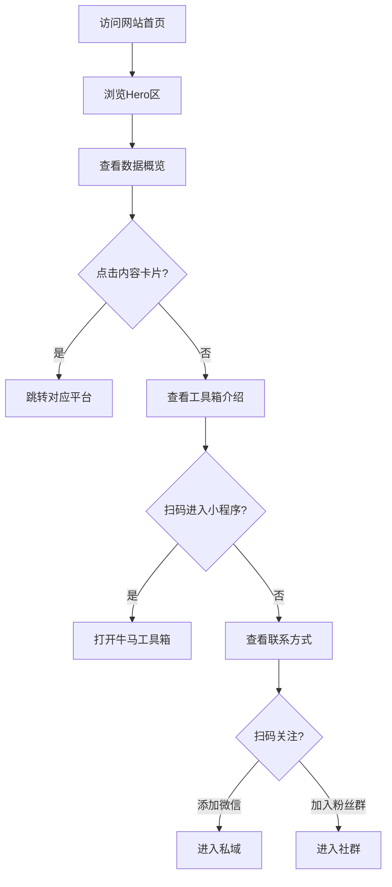

## 1. Product Overview

**职场驴驴 - 个人IP商业化官网**

这是一个高端商业化的个人IP展示网站，旨在整合「小瓜漫画鸭」微信生态（公众号+视频号）、「职场驴驴」小红书账号、「牛马工具箱新」小程序三大渠道资源，统一IP形象与内容赛道，建立品牌认知度，促进私域转化与商业合作。

**目标用户：** 职场人群、品牌方、广告主、潜在合作方、关注职场成长的粉丝

**市场价值：** 打造专业的个人品牌资产，提升IP商业化能力，为后续知识付费、广告合作、电商带货等商业变现奠定基础。

---

## 2. Core Features

### 2.1 User Roles

| Role | Registration Method | Core Permissions |
|------|---------------------|------------------|
| 访客 | 无需注册 | 浏览网站、扫码关注、查看内容 |
| 合作方 | 无需注册 | 查看合作信息、扫码联系 |

### 2.2 Feature Module

1. **首页（Hero区）**：IP形象展示、品牌主张、核心卖点、CTA引导
2. **内容矩阵页**：微信公众号、视频号、小红书三大渠道内容展示
3. **工具箱展示页**：牛马工具箱小程序功能介绍
4. **关于/联系方式页**：个人介绍、价值观、二维码入口

### 2.3 Page Details

| Page Name | Module Name | Feature description |
|-----------|-------------|---------------------|
| 首页 | Hero区 | IP形象大图、品牌口号、核心数据展示、关注引导按钮 |
| 首页 | 数据概览 | 各渠道粉丝数、内容产出量、互动数据可视化展示 |
| 首页 | 内容精选 | 精选漫画/视频卡片，点击跳转对应平台 |
| 首页 | 工具箱介绍 | 小程序功能亮点、使用场景、入口引导 |
| 首页 | 联系入口 | 个人微信二维码、粉丝群二维码、合作邮箱 |

---

## 3. Core Process

**访客浏览路径：**

1. 用户进入首页 → 看到IP形象和品牌主张
2. 向下滚动 → 查看各渠道数据概览
3. 点击内容卡片 → 跳转对应平台（微信/小红书）
4. 查看工具箱介绍 → 扫码进入小程序
5. 页面底部 → 扫码添加微信/加入粉丝群



---

## 4. User Interface Design

### 4.1 Design Style

**整体风格：** 现代简约、商务休闲、年轻化

- **主色调：** 深蓝色（#1a365d）+ 活力橙（#f59e0b）
- **辅助色：** 浅灰（#f3f4f6）、白色（#ffffff）
- **按钮风格：** 圆角矩形（8px）、渐变背景、悬停动效
- **字体：** 无衬线字体（Inter/Sans），标题加粗，正文清晰
- **布局：** 卡片式布局、响应式设计、充足留白
- **图标风格：** 简约线性图标，统一尺寸与风格

### 4.2 Page Design Overview

| Page Name | Module Name | UI Elements |
|-----------|-------------|-------------|
| 首页 | Hero区 | 大号IP形象图、渐变背景、品牌口号大标题、统计数据数字动画、关注引导按钮（悬停缩放） |
| 首页 | 数据概览 | 四宫格卡片布局、图标+数据+标签、hover阴影效果 |
| 首页 | 内容矩阵 | 横向滚动卡片列表、封面图+标题+数据、卡片hover上浮效果 |
| 首页 | 工具箱 | 功能图标网格、渐变背景卡片、扫码入口按钮 |
| 首页 | 联系入口 | 双二维码并排展示、扫码提示文字、合作邮箱链接 |

### 4.3 Responsiveness

- **桌面端（≥1200px）：** 完整布局，多列展示
- **平板端（768px-1199px）：** 自适应两列布局
- **移动端（<768px）：** 单列堆叠，优化触控体验

### 4.4 动效设计

- 页面加载：渐入动画
- 滚动：视差效果、元素入场动画
- 卡片：hover上浮、阴影加深
- 按钮：缩放反馈、颜色过渡
- 数据：数字滚动动画

---

## 5. Content Requirements

### 5.1 品牌信息

| 项目 | 内容 |
|------|------|
| IP名称 | 职场驴驴 |
| 品牌口号 | 打工人职场干货漫画 |
| IP形象 | 职场西装毛驴（戴眼镜、穿西装） |
| 内容赛道 | 职场干货、沟通话术、晋升避坑、人情世故 |
| 定位 | 普通人能用的职场经验分享 |

### 5.2 各渠道数据

| 渠道 | 名称 | 粉丝数 | 内容量 | 核心数据 |
|------|------|--------|--------|----------|
| 公众号 | 小瓜漫画鸭 | 721 | 83篇原创 | 职场漫画图文 |
| 视频号 | 小瓜漫画鸭 | 158 | 48条视频 | 总播放531、点赞394 |
| 小红书 | 职场驴驴 | 57 | 14篇笔记 | 单篇最高浏览271 |
| 小程序 | 牛马工具箱新 | 542累计用户 | 实用工具 | 日活12+ |

### 5.3 二维码展示

- **个人微信二维码**：页面底部显眼位置，配文"扫码添加作者微信"
- **粉丝群二维码**：页面底部，配文"加入粉丝群交流"

---

## 6. Technical Architecture

### 6.1 技术选型

- **前端框架**：React 18 + Vite
- **样式方案**：TailwindCSS 3
- **图标库**：Lucide React
- **动画库**：Framer Motion
- **构建工具**：Vite
- **部署方案**：静态站点托管（Vercel/Netlify/GitHub Pages）

### 6.2 页面结构

```
/
├── index.html          # 入口HTML
├── src/
│   ├── main.tsx        # 应用入口
│   ├── App.tsx         # 主组件
│   ├── components/     # 组件目录
│   │   ├── Hero.tsx           # 首屏展示区
│   │   ├── Stats.tsx          # 数据统计区
│   │   ├── ContentMatrix.tsx  # 内容矩阵展示
│   │   ├── Toolbox.tsx        # 工具箱介绍
│   │   ├── Contact.tsx        # 联系方式区
│   │   └── Footer.tsx         # 页脚
│   ├── data/           # 数据文件
│   │   └── content.ts  # 内容数据
│   └── styles/         # 全局样式
│       └── index.css
├── package.json
├── tsconfig.json
├── vite.config.ts
└── tailwind.config.js
```

### 6.3 核心组件设计

**Hero组件：**
- IP形象大图（居中展示）
- 品牌口号（大号字体）
- 核心标签（3-4个）
- CTA按钮（引导关注）

**Stats组件：**
- 四个数据卡片（公众号/视频号/小红书/小程序）
- 每个卡片包含：图标、数字、标签
- 数字滚动动画效果

**ContentMatrix组件：**
- 横向滚动容器
- 内容卡片（封面图、标题、阅读/播放量、平台标识）
- 点击跳转外部链接

**Toolbox组件：**
- 工具箱图标网格
- 功能名称与描述
- 小程序入口二维码

**Contact组件：**
- 双二维码并排
- 扫码提示文字
- 合作邮箱链接

---

## 7. 项目里程碑

| 阶段 | 任务 | 交付物 |
|------|------|--------|
| 1 | PRD设计与确认 | PRD文档 |
| 2 | 技术架构搭建 | 项目初始化、依赖配置 |
| 3 | 组件开发 | 各功能组件实现 |
| 4 | 样式与动效 | UI优化、动画效果 |
| 5 | 内容填充 | 数据录入、二维码添加 |
| 6 | 测试与部署 | 响应式测试、上线部署 |

---

## 8. 风险与应对

| 风险 | 应对措施 |
|------|----------|
| 二维码过期 | 预留后台更新接口或定期替换图片 |
| 外部链接失效 | 添加链接有效性检查机制 |
| 数据实时性 | 设计数据更新模板，定期手动更新 |
| 移动端适配 | 优先移动端设计，多设备测试 |